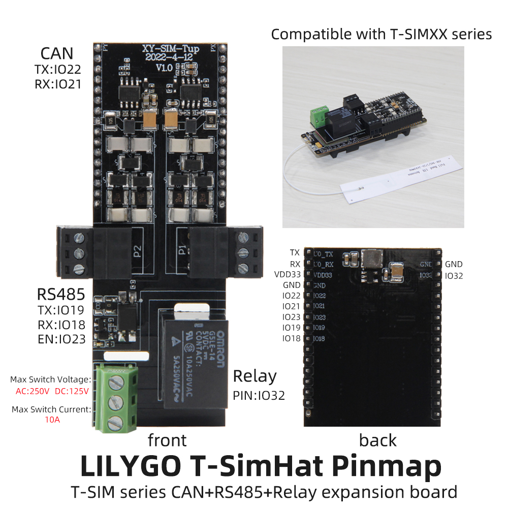

<h1 align = "center">🌟LILYGO T-SIMHAT🌟</h1>

## **English | [中文](./README_CN.MD)**

<h3 align = "left">Quick start:</h3>

**USE Arduino IDE**

1. T-SimHat
①. Install the current upstream Arduino IDE at the 1.8 level or later. The current version is at the [Arduino website](http://www.arduino.cc/en/main/software).
②. Start Arduino and open Preferences window. In additional board manager add url: https://raw.githubusercontent.com/espressif/arduino-esp32/gh-pages/package_esp32_index.json .separating them with commas.
③. Select Tools -> Board -> ESP32 Dev Module
④. Need to install the following dependencies
     - [blynk](https://github.com/blynkkk/blynk-library)
     - [TinyGSM](https://github.com/vshymanskyy/TinyGSM)
     - [StreamDebugger](https://github.com/vshymanskyy/StreamDebugger)
     - [ArduinoHttpClient](https://github.com/ricemices/ArduinoHttpClient)
     - [ESP32-Arduino-CAN](https://github.com/miwagner/ESP32-Arduino-CAN)

2. T-SimHat-INA291
①. Install the current upstream Arduino IDE at the 1.8 level or later. The current version is at the [Arduino website](http://www.arduino.cc/en/main/software).
②. Start Arduino and open Preferences window. In additional board manager add url: https://raw.githubusercontent.com/espressif/arduino-esp32/gh-pages/package_esp32_index.json .separating them with commas.
③. Select Tools -> Board -> ESP32 Dev Module
④. Libraries that need to be installed.   T-SimHat-INA291/lib.   Libraries in the lib directory
     - [DHT-sensor-library](https://github.com/adafruit/DHT-sensor-library.git)
     - [Adafruit_Sensor](https://github.com/adafruit/Adafruit_Sensor.git)
     - [Adafruit_BusIO](https://github.com/adafruit/Adafruit_BusIO)

**USE PlatformIO**

1. Install[VSCODE](https://code.visualstudio.com/)and[Python](https://www.python.org/)
2. Search for the PlatformIO plug-in in the VSCODE extension and install it.
3. After the installation is complete and the reload is completed, there will be a small house icon in the lower left corner. Click to display the Platformio IDE home page
4. In the platformio.ini file, select the sketch you want to compile 
5. 5. Go to File->; Open the folder ->; Select the examples- T-SimHat or T-Simhat-ina291 folder and click the (√) symbol in the bottom left corner to compile (→) upload.

<h3 align = "left">Product 📷:</h3>

| Product  | Product  Link  |
| :------: | :------------: |
| T-SimHat | [AliExpress]() |

## Pinout

