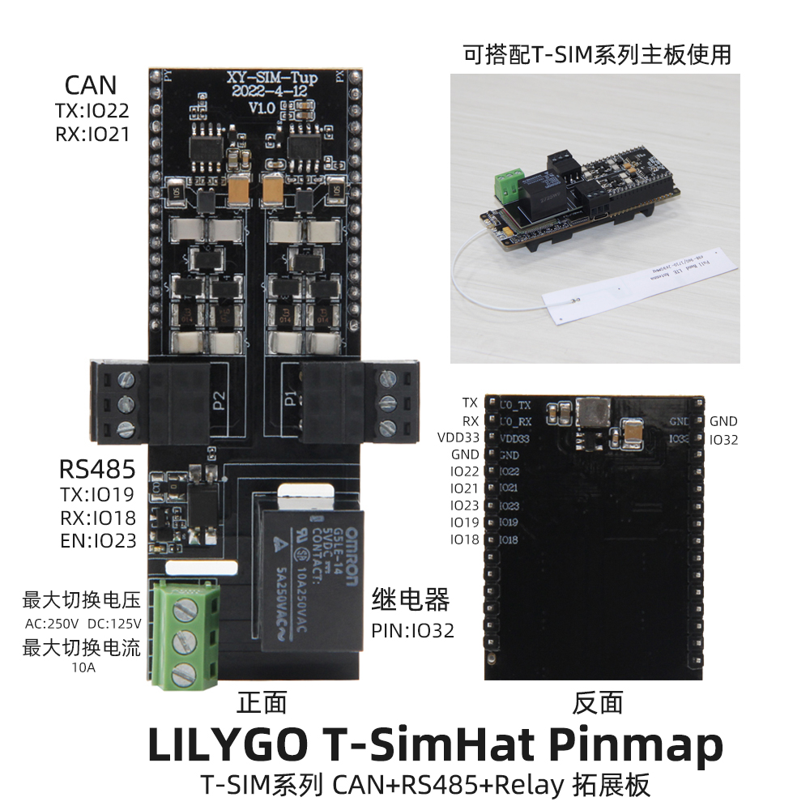
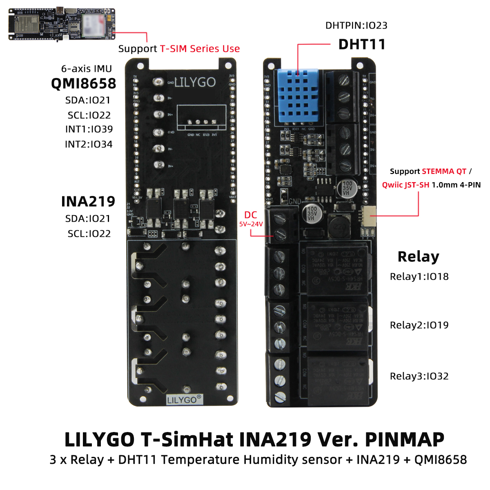

<h1 align = "center">🌟LILYGO T-SimHat🌟</h1>

## **English | [中文](./README_CN.MD)**

<h3 align = "left">快速开始:</h3>

**使用 Arduino**

1. T-SimHat
①. 安装1.8以上的[Arduino IDE](http://www.arduino.cc/en/main/software).
②. 打开Arduino IDE 在文件->首选项->附加开发板管理器网站添加 https://raw.githubusercontent.com/espressif/arduino-esp32/gh-pages/package_esp32_index.json .最后用以逗号隔开。(由于这个网站服务器在国外，可能比较慢或者不成功。也可以参考[LilyGo-Document](https://github.com/Xinyuan-LilyGO/LilyGo-Document)来搭建)
③. 选择"工具"->开发板 -> ESP32 Dev Module
④. 需要安装的库
     - [blynk](https://github.com/blynkkk/blynk-library)
     - [TinyGSM](https://github.com/vshymanskyy/TinyGSM)
     - [StreamDebugger](https://github.com/vshymanskyy/StreamDebugger)
     - [ArduinoHttpClient](https://github.com/ricemices/ArduinoHttpClient)
     - [ESP32-Arduino-CAN](https://github.com/miwagner/ESP32-Arduino-CAN)

2. T-SimHat-INA291
①. 安装1.8以上的[Arduino IDE](http://www.arduino.cc/en/main/software).
②. 打开Arduino IDE 在文件->首选项->附加开发板管理器网站添加 https://raw.githubusercontent.com/espressif/arduino-esp32/gh-pages/package_esp32_index.json .最后用以逗号隔开。(由于这个网站服务器在国外，可能比较慢或者不成功。也可以参考[LilyGo-Document](https://github.com/Xinyuan-LilyGO/LilyGo-Document)来搭建)
③. 选择"工具"->开发板 -> ESP32 Dev Module
④. 需要安装的库，T-SimHat-INA291/lib.  lib目录下的库
     - [DHT-sensor-library](https://github.com/adafruit/DHT-sensor-library.git)
     - [Adafruit_Sensor](https://github.com/adafruit/Adafruit_Sensor.git)
     - [Adafruit_BusIO](https://github.com/adafruit/Adafruit_BusIO)
     
           

     

**使用 PlatformIO**

①. 安装[VSCODE](https://code.visualstudio.com/)和[Python](https://www.python.org/)
②. 在VSCODE扩展中搜索PlatformIO插件并安装。 
③. 安装完成，重新加载完成后，左下角会出现一个小房子图标。 单击，进入platform IDE主页 
④. 在platformio.ini文件中选择你想编译的草图
⑤. 进入文件- >打开文件夹- >选择 examples- T-SimHat 或 T-SimHat-INA291 文件夹，点击左下角的(√)符号编译(→)上传。 
   

<h3 align = "left">Product 📷:</h3>

|   Product    | Product  Link |
| :----------: | :-----------: |
| [T-SimHat]() |               |

## Pinout

